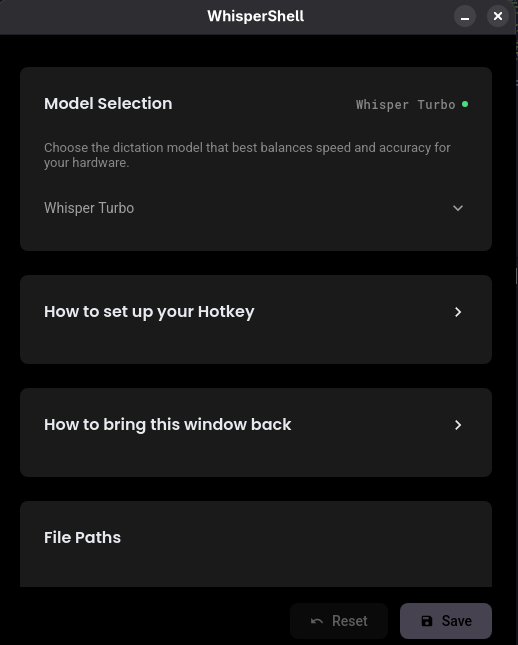
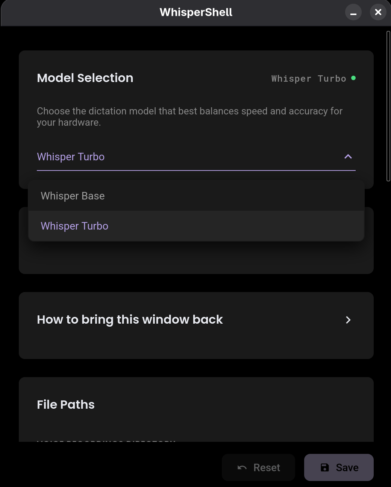

#  WhisperShell

[Website](https://whispershell.tech) | [Documentation](https://whispershell.tech/docs)

WhisperShell is an offline voice-to-text tool providing system-wide dictation for Linux Wayland. Voice data is processed locally.

## System Requirements

- **Operating System:** RPM-based Linux distribution running Wayland (X11 is not supported).
- **Hardware:** NVIDIA GPU with proprietary drivers is recommended for inference.

## Installation

### Copr Repository (Fedora)

Enable the repository and install:

```bash
sudo dnf copr enable muhammad-shah-zaib/whispershell
sudo dnf install whispershell
```

### Manual Package Installation

[Download RPM Package (v0.1.0)](https://github.com/Muhammad-Shah-zaib/WhisperShell/releases/download/v0.1.0/WhisperShell-0.1.0-1.x86_64.rpm)

After downloading, navigate to the download directory and install it via the terminal:

```bash
cd ~/Downloads
sudo dnf install ./WhisperShell-0.1.0-1.x86_64.rpm
```

## Configuration

### Model Selection

A local Whisper model is required. 

- **Base Model:** Balanced speed and accuracy. Suitable for CPU.
- **Turbo Model:** Higher accuracy. Recommended for GPU.

Open the configuration panel to download and select a model:

```bash
whispershell --toggle-config
```

<table>
  <tr>
    <td></td>
    <td></td>
  </tr>
</table>

### Hotkeys Setup

Configure global shortcuts in your desktop settings to trigger commands.

**Toggle Voice Recording**
Command: `whispershell --toggle-recording`
Example Shortcut: `Super + Space`


**Toggle Configuration**
Command: `whispershell --toggle-config`
Example Shortcut: `Super + Shift + Space`

## File Paths

Default directories (customizable in the configuration panel):

- **Models:** `~/.local/share/whispershell/models`
- **Error Logs:** `~/.local/state/whispershell/errors`
- **Messages Log:** `~/.local/share/whispershell/messages.log`
- **Recordings:** `~/.local/share/whispershell/recordings`

## Troubleshooting

- **Application Freezes:** Restart using `pkill whispershell && whispershell`.
- **Transcription Delay:** Use the Base model if hardware resources are limited.
- **Display Server:** Ensure you are using Wayland, as X11 is unsupported.
